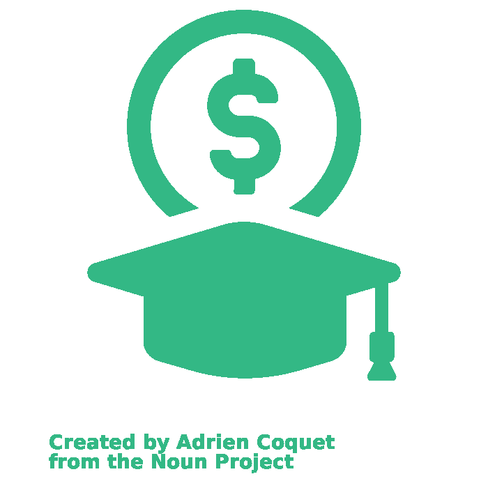

# Interest
  
 
<h2 style="text-align:center">Student Loan Calculation and Visualization Tool</h2>

This web application aims to address the issue of financial illiteracy for college students. A common complication amongst college students is graduating with more debt than expected. This can be due to unexpected accumulation of interest during and after college as well as due to unrealistic expectations of post-graduation earnings. By providing information and generating visualizations for the user, we will help inform and eliminate illiteracy for every student who is interested in learning about their student loan debt by using our product.

 

   

## Contributors
Katelyn Kunzmann - https://github.com/KatelynKunzmann

Pran Sutham - https://github.com/PranSutham

Isaiah Gathala - https://github.com/isaiahgman

## Attribution
| **Description** | **Sourced From:** | **Title** | **Artist** | **Website Link** | **License** | **License Link** |
|---|---|---|---|---|---|---|
| Interest Icons |Noun Project|Scholarship|Adrien Coquet|https://thenounproject.com/icon/scholarship-3734358/|Creative Commons by 2.0|https://creativecommons.org/licenses/by/2.0/|
